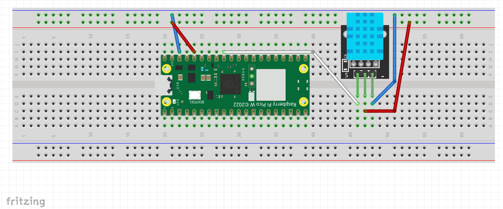

Created by: Kristoffer Larsson

Student credentials: kl223kk

Date: 2023 july
# Temperature-and-Humitidy-System
In this tutorial I will provide you with a comprehensive guide on utilizing the Raspberry Pi Pico W to wirelessly transmit humidity and temperature information from any location where you have access to Wi-Fi and a power source. You will need a Raspberry Pi Pico W, a DHT11 sensor, MicroPython code, an Adafruit account and a computer. I'll show you how to set up the Raspberry Pi Pico W, connect the DHT11 sensor, and write code in MicroPython to collect and transmit the data. By following the instructions you'll learn the basics of these components and be able to create a system that monitors and sends humidity and temperature data.

Time estimation for project: 5 hours

# 1. Objectives

**1.1 The why**

Early on I knew that I wanted to use the DHT11 sensor to monitor my room, this to be able to get a clear understanding of how the climate in my apartment changes over the day. The fact that the DHT11 sensor also meausures humitidy made it clear to me that this sensor also were more superiour than a standard thermostate.

**1.2 Purpose**

The main goal of this project is to help users learn the basics of working with microcontrollers and basic sensors. It aims to provide an introduction and familiarize them with the fundamentals of these technologies, allowing them to gain practical knowledge and skills. By engaging in this project, users will be able to understand how microcontrollers and sensors work together and explore their potential applications.

**1.3 Insights that the project might bring**

After going through this tutorial, you will gain a basic understanding of how to work with the Raspberry Pi Pico W, the DHT11 sensor, Adafruit, and MicroPython. You will learn about the features and applications of the Raspberry Pi Pico W microcontroller board, collect temperature and humidity data using the DHT11 sensor, explore the capabilities of Adafruit for expanding your project options, and use MicroPython to write code for interacting with hardware components. This tutorial will equip you with the essential knowledge to also start working on your own microcontroller projects.

# 2. Material
| Material name | Functionality | Where to buy | Cost |
|----------|----------|----------|----------|
| Raspberry Pi Pico W   | Microcontroller that runs programs and have multiple pins for connections to sensors. Also has the capability of running on Wi-Fi.   | https://www.electrokit.com/produkt/raspberry-pi-pico-w/   | 98kr |
| USB to micro-USB cable    | Transfers electricity to the microcontroller, which both gives it electricity to run, but also makes it possible to program it when plugged into a computer.   | https://www.electrokit.com/produkt/usb-kabel-a-hane-mini-b-hane-5p-1-8m/| 39kr |
| Sensor DHT11   | A sensor that measures the temperature and humidity.   | https://www.electrokit.com/produkt/digital-temperatur-och-fuktsensor-dht11/| 49kr |
| Breadboard| A breadboard with connections that makes it easier to connect the microcontroller with the sensors.   | https://www.electrokit.com/en/product/solderless-breadboard-400-tie-points/   | 49kr |
| Cables – male to male   | Connects electricity between the microcontroller, sensors and the power supply.   | https://www.electrokit.com/produkt/labsladd-1-pin-hane-hane-150mm-10-pack/|29kr |
| Computer  | To program the microcontroller on |


# 3. Environment Setup
**3.1 Why I choose Thonny**

The primary factor that influenced my decision to opt for Thonny as my preferred Integrated Development Environment (IDE) was the fact that I had no prior experience or knowledge about it. This unfamiliarity intrigued me, and upon exploring Thonny, I swiftly developed a preference for its simplistic setup and user interface (UI). The straightforwardness and ease of use provided by Thonny further solidified my choice.

Although that Thonny were my choice I actually also tried to use VScode and it also worked quite well, though in this tutorial I will only cover Thonny, but remember that VScode absolutly also is an option.

**3.2 Setting up the raspberry**

Step 1: Remove the black sponge from the Pico.

Step 2: Download the micropython firmware, you will get a uf2 file, be sure to chose the latest from **releases** category: https://micropython.org/download/rp2-pico-w/

Step 3: Connect your raspberry pi to your computer by using the micro-usb cable.

Step 4: While holding the BOOTSEL key on the raspberry, connect to your computer. Release the button after you see a new drive with the name RPI-RP2.

Step 5: Paste the uf2 file into the raspberry and wait till it disconnects and reconnects to your computer.

You have now updated the firmware on your raspberry and are ready to use it!

**3.3 Setting up Thonny**

Step 1: Download Thonny from: https://github.com/thonny/thonny/releases/download/v4.0.2/thonny-4.0.2.exe

Step 2: Open Thonny and press View >> Files to open the file manager panel.


Step 3: Open interpreter from Run >> Configure interpreter


Step 4: Choose MicroPython as your interpreter and after that choose your USB-port that is connected to your raspberry.


You now have succeded with connecting your raspberry to Thonny, and your chosen programming language is micropython. When saving you will see that you can either choose to save it on your computer or your Raspberry pi pico. 


# 4. Putting everything togheter

**Note: The importance here isn't that you place the microcontroller on the exact same spot as I've done it, but rather that the wiring is the same**

For more information on the raspberry pi checkout **https://www.raspberrypi.com/documentation/microcontrollers/raspberry-pi-pico.html**
# 5. Platforms and infrastructure
**5.1 Why I choose MQTT as my messaging protocol and Adafruit as my platform**

After just a couple of tries with MQTT I quickly realized that this would be more than enough for this project. I navigated to the Adafruit website and quickly got started with sending data from my device to the internet. The technical aspect was in my opinion not very hard to understand, and the code that you needed to provide were straightforward (more on this in the next part).

**5.2 How to get acess to MQTT with Thonny**

Step 1: Head over to adafruit and create an user: www.adafruit.com

Step 2: Now in Thonny go to Tools >> Packages and install micropython-umqtt-simple (You can verify that it’s been installed by checking the file section in Thonny).

Step 3: Save the files onto your Raspberry pi.


**5.3 Creation of feeds and dashboard**

Step 1: In adafruit.com go to IO and then Feeds.

Step 2: Create two new feeds, one named temperature-graph and one named humitidy-graph. These feeds will be of use to us later.

Step 3: Create a new dashboard and add your two newly created feeds in two seperate line charts.

If you have any problem with the installation or MQTT/Adafruit then I highly reccomend this video:

https://www.youtube.com/watch?v=ybCMXqsQyDw

It doesn't explain this tutorial but it can give you an understanding of how to work with MQTT.

After this you can start programming, the next step will explain how to do that! 
# 6. The code

**boot.py**

In MicroPython, boot.py is a special filename that is commonly used for a script that runs automatically when a MicroPython device boots up. This file is executed during the boot process, allowing you to perform initialization tasks or set up the device's configuration before the main application code is run.

In this Boot.py-file we connect to the Wi-Fi, the only thing you have to do is copy my code in the boot.py file and enter your own wifi_ssid and wifi_password! 

``` python
import network
import time

# Fill in your WiFi network name (ssid) and password here:
wifi_ssid = ""
wifi_password = ""

# Connect to WiFi
wlan = network.WLAN(network.STA_IF)
wlan.active(True)
wlan.connect(wifi_ssid, wifi_password)
while not wlan.isconnected():
    print('Waiting for connection...')
    time.sleep(1)
print("Connected to WiFi")

```

**main.py**

This is a snippet of the file that runs after boot.py have connected to the internet, this will be done automatically. Beaware that you need to enter your Adafruit IO username, IO key, MQTT topics which are the feeds we created earlier (check 5.3) and a mqtt_client_id.

After this have been done your sensors will collect the data and send it to your adafruit feeds.

``` python

# Fill in your Adafruit IO Authentication and Feed MQTT Topic details
mqtt_host = "io.adafruit.com"
mqtt_username = ""  # Your Adafruit IO username
mqtt_password = ""  # Adafruit IO Key
mqtt_temperature_topic = ""  # Temperature MQTT topic
mqtt_humidity_topic = ""  # Humidity MQTT topic

# Enter a random ID for this MQTT Client
# It needs to be globally unique across all of Adafruit IO.
mqtt_client_id = ""

# Initialize our MQTTClient and connect to the MQTT server
mqtt_client = MQTTClient(
    client_id=mqtt_client_id,
    server=mqtt_host,
    user=mqtt_username,
    password=mqtt_password)

mqtt_client.connect()

```
This next part of the code now takes the values from the sensors and publish it to our feeds. The feeds on the dashboard will now show the temparture and humitidy value of where you have put your setup. The button part which says ``` python time.sleep(10) ``` is telling us how many times that we are sending our values in seconds, in this example we are sending it every ten second. This can be modified by you as a user to your preference.

``` python
# Initialize the DHT sensor
tempSensor = dht.DHT11(machine.Pin(27))     # DHT11 Constructor

try:
    while True:
        tempSensor.measure()
        temperature = tempSensor.temperature()
        humidity = tempSensor.humidity()
        print("Temperature is {} degrees Celsius and Humidity is {}%".format(temperature, humidity))

        # Publish temperature data
        mqtt_client.publish(mqtt_temperature_topic, str(temperature))
        print("Temperature data published")

        # Publish humidity data
        mqtt_client.publish(mqtt_humidity_topic, str(humidity))
        print("Humidity data published")

        time.sleep(10)

except Exception as error:
    print("Exception occurred:", error)

finally:
    mqtt_client.disconnect()

```
# 7. The physical network layer
The DHT11 sensor collects information like temperature and humidity. This information travels through the cables to the microcontroller. The microcontroller then sends the data to Adafruit using WiFi. At Adafruit, the data is shown on a line chart, which is a visual representation of how the values change over time.
# 8. Visualization
The image below is from the microPython Shell, and here it tells us that our data have been published!


And here is an example in adafruit how it can looks when we decide to make a graph of it. The example I use is circa 10 minutes, but the limitation of the duration which you want to collect data is up to you as an user, you can let it run for as long as you have a power source for the microcontroller and connection to Wi-Fi.


# 9. Finalizing the design
I liked this project overall and I realise that there are alot of ways to make it more advanced. This could for example be creating an UI for the user where they can see the dashboard instead of having to log into adafruit or having led-lights on the breadboard which would glow if the DHT11-sensor reached a certain value. These are additions that I would personally add if I had more time, but as this is a public project I invite anyone to take what you have learned here and try it out yourself.

This project has been a really fun and educational journey for me, introducing me to the world of IoT. Previously, I had experience programming software, but I had never ventured into the realm of physical programming. Exploring the IoT field has been incredibly interesting, as it feels like there are endless possibilities limited only by our imagination. 


